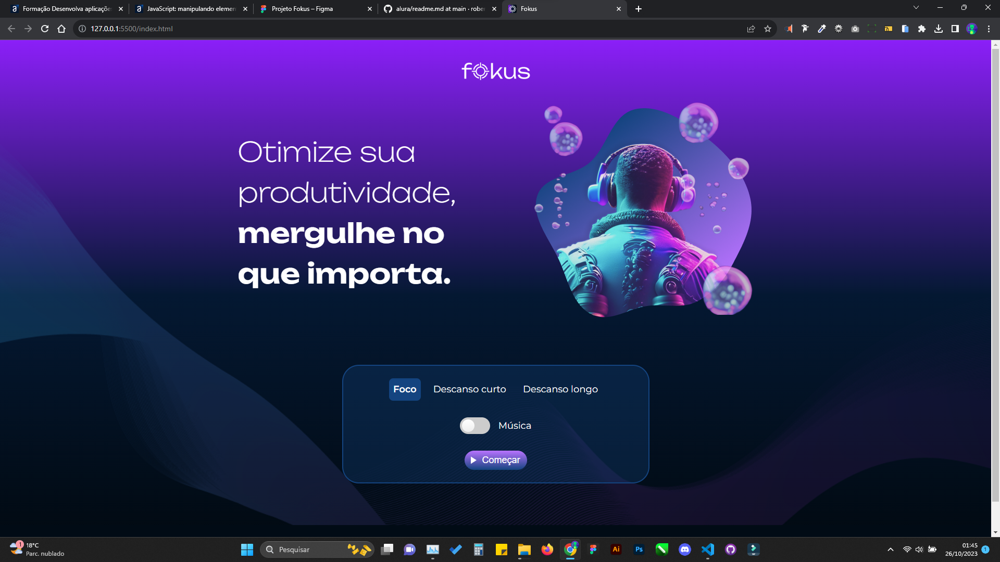

<h1 align="center"> Projeto Alura Fokus</h1>

Este é o 3º projeto em desenvolvimento utilizando JavaScript com foco na manipulação do DOM, que faz parte da Formação Front End da Platafroma Alura, apresentado por Luan Alves.🧑‍🚀❤️‍🔥 

  <a href="#-tecnologias">Tecnologias</a>&nbsp;&nbsp;&nbsp;|&nbsp;&nbsp;&nbsp;
  <a href="#-projeto">Projeto</a>&nbsp;&nbsp;&nbsp;|&nbsp;&nbsp;&nbsp;
  <a href="#-layout">Layout</a>&nbsp;&nbsp;&nbsp;|&nbsp;&nbsp;&nbsp;
  <a href="#memo-licença">Licença</a>

  

 

  

    
  

 
 

 

## 🚀 Tecnologias

Esse projeto está sendo desenvolvido com as seguintes tecnologias:

<li> HTML
<li> CSS
<li> JavaScript
<li> GitHub

## 💻 Projeto

Este projeto se chama "Alura Fokus". 

Feito para auxiliar na hora de manter o foco nos estudos, utilizando a metodologia pomodoro.  
Podem ser utilizadas pausas curtas ou longas, com ou sem música de fundo para concentração.  
Também possui sons de ativação para identificar cada opção selecionada.

 Para visualizar a versão atual do projeto é só<a href="https://robertojunnior.github.io/alura-fokus/"> "Clicar aqui".</a>🚀

## 🔖 Layout

🖼️ Este projeto foi desenvolvido por ALURA. 

## :memo: Licença

Este projeto está sob a licença MIT.
 
---

Feito ❤️‍ by Roberto Junior 😁:wave:
 🧑‍🚀[Inscreva-se no canal do YouTube da Alura!](https://www.youtube.com/@Alura)

<h4> Obrigado por visitar meu Git e se chegou até aqui dê um "Follow" que retribuo, podemos nos conectar para trocas de ideias e novos projetos.
   
   

 Até a próxima! 😁🖖.
